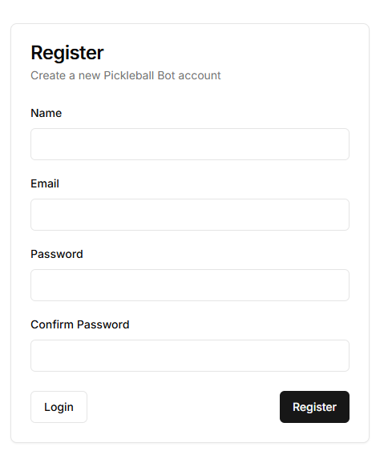

# Lifetime Pickleball Scheduler

A full-stack application for scheduling and managing pickleball sessions at Lifetime Fitness. This project includes both a web interface and automated scheduling system. https://multi-user-lifetime-app.vercel.app/

## UI Showcase

### Main Schedule Interface

*Modern interface for viewing and scheduling pickleball sessions*

### Scheduling Dialog

*Easy one-click scheduling interface with session details*

### Scheduled Sessions

*View your upcoming scheduled sessions with status indicators*

### Account Settings

*Secure credential management interface*

### Login Screen

*Clean and simple login interface*

### Register Screen

*Quick and easy registration process*

## Features

- 🎾 Real-time session availability tracking
- 🤖 Automated session scheduling with smart booking logic
- 🔔 Session status notifications and confirmations
- 📅 Weekly calendar view with session details
- 🔒 Secure authentication and credential management
- 📱 Mobile-responsive design
- 🎯 DUPR level filtering and session targeting
- 🤝 Partner matching for drill sessions

## Tech Stack

- **Frontend**: Next.js, React, TypeScript, Tailwind CSS
- **Backend**: Next.js API Routes
- **Database**: Prisma with SQLite/PostgreSQL
- **Authentication**: Custom auth system
- **Deployment**: Vercel
- **Automation**: Python scripts for session management

## Project Structure

```
├── app/                    # Next.js application code
│   ├── api/               # API routes
│   ├── actions.ts         # Server actions
│   └── types/             # TypeScript types
├── components/            # React components
├── lib/                   # Utility functions
│   ├── auth.ts           # Authentication utilities
│   └── time-utils.ts     # Time calculation utilities
├── prisma/               # Database schema
├── scripts/              # Python automation scripts
│   ├── bot/             # Bot-related scripts
│   └── cloud/           # Cloud function scheduling scripts
└── public/              # Static assets
```

## Getting Started

### Prerequisites

- Node.js 18+ and npm
- Python 3.8+ (for automation scripts)
- Lifetime Fitness account

### Installation

1. Clone the repository:
   ```bash
   git clone https://github.com/eloco17/lifetime-scraper.git
   cd lifetime-scraper
   ```

2. Install dependencies:
   ```bash
   npm install
   ```

3. Set up environment variables:
   ```bash
   cp .env.example .env.local
   ```
   Edit `.env.local` with your configuration.

4. Initialize the database:
   ```bash
   npx prisma generate
   npx prisma db push
   ```

5. Start the development server:
   ```bash
   npm run dev
   ```

### Environment Variables

Create a `.env.local` file with the following variables:

```env
# Database
DATABASE_URL="file:./dev.db"

# Authentication
NEXTAUTH_SECRET="your-secret-key"
NEXTAUTH_URL="http://localhost:3000"

# Lifetime Fitness
LIFETIME_USERNAME="your-username"
LIFETIME_PASSWORD="your-password"

# Optional: For production
NODE_ENV="production"
```

## Automation Scripts

The project includes Python scripts for automated session management:

- `scripts/bot/lt_bot.py`: Main bot for session scheduling
- `scripts/cloud/server.js`: Cloud function scheduling the automated google task

To run the bot:
```bash
python scripts/bot/lt_bot.py
```

## Contributing

1. Fork the repository
2. Create your feature branch (`git checkout -b feature/amazing-feature`)
3. Commit your changes (`git commit -m 'Add some amazing feature'`)
4. Push to the branch (`git push origin feature/amazing-feature`)
5. Open a Pull Request

## License

This project is licensed under the MIT License - see the [LICENSE](LICENSE) file for details.

## Acknowledgments

- [Next.js](https://nextjs.org/)
- [Prisma](https://www.prisma.io/)
- [Tailwind CSS](https://tailwindcss.com/)
- [Lifetime Fitness](https://www.lifetime.life/) 
